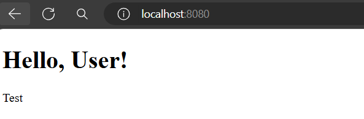
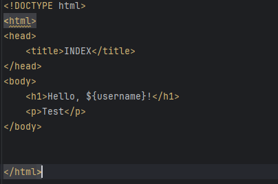
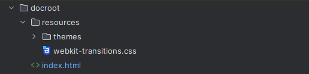

# HelloWtApp2

## Screenshots

## 1

## 2

## 3



## Installation

## Pre-requirements:

Wt is required to run the web app.

## FOR MacOS
# Install necessary packages
```sh
brew install gcc cmake boost openssl harfbuzz graphicsmagick pango postgresql@14 mysql unixodbc zlib fcgi qt@5
```

# Install Firebird from source
```sh
curl -LO https://github.com/FirebirdSQL/firebird/releases/download/R3_0_7/Firebird-3.0.7.33374-0.tar.gz
tar -xzvf Firebird-3.0.7.33374-0.tar.gz
cd Firebird-3.0.7.33374-0
./configure
make
sudo make install
cd ..
```

# Configure gcc and g++ with C++14 standard
```sh
echo 'export CC=/usr/local/bin/gcc-$(brew list --versions gcc | awk "{print \$2}" | cut -d. -f1)' >> ~/.zshrc
echo 'export CXX=/usr/local/bin/g++-$(brew list --versions gcc | awk "{print \$2}" | cut -d. -f1)' >> ~/.zshrc
echo 'export CXXFLAGS="$CXXFLAGS -std=c++14"' >> ~/.zshrc
echo 'export CFLAGS="$CFLAGS -std=c++14"' >> ~/.zshrc
source ~/.zshrc
```
# Install and secure MySQL
```sh
brew install mysql
brew services start mysql
mysql_secure_installation
```
# Unlink MySQL and install MariaDB (optional)
```sh
brew unlink mysql
brew install mariadb
brew link mariadb
brew services start mariadb
mysql_secure_installation
```
# Clone and build Wt library
```sh
git clone https://github.com/emweb/wt.git
mkdir wt/build
cd wt/build
cmake ..
make -j4
sudo make install
```


## FOR LINUX

One command:
```sh
sudo apt update && sudo apt install gcc g++ cmake libboost-all-dev libssl-dev libhpdf-dev libgraphicsmagick1-dev libpango1.0-dev libpq-dev libmysqlclient-dev libmariadb-dev unixodbc-dev libunwind-dev zlib1g-dev firebird-dev libfcgi-dev libqt5core5a libqt5gui5 libqt5widgets5 libqt5sql5
```

Configuring g++ and gcc with alternatives, and setting C++14:
```sh
sudo update-alternatives --install /usr/bin/gcc gcc /usr/bin/gcc-<version> 60 \
&& sudo update-alternatives --install /usr/bin/g++ g++ /usr/bin/g++-<version> 60 \
&& echo 'export CXXFLAGS="$CXXFLAGS -std=c++14"' | sudo tee /etc/profile.d/gcc.sh \
&& echo 'export CFLAGS="$CFLAGS -std=c++14"' | sudo tee -a /etc/profile.d/gcc.sh \
&& source /etc/profile.d/gcc.sh
```


Compiler:
```sh
sudo apt update
sudo apt install gcc g++
```
Cmake:
```sh
sudo apt update
sudo apt install cmake
```
C++ Boost Library:
```sh
sudo apt update
sudo apt install libboost-all-dev
```
OpenSSL:
```sh
sudo apt update
sudo apt install libssl-dev
```
Haru Free PDF Library:
```sh
sudo apt update
sudo apt install libhpdf-dev
```
GraphicsMagick:
```sh
sudo apt update
sudo apt install libgraphicsmagick1-dev
```

Pango:
```sh
sudo apt update
sudo apt install libpango1.0-dev
```

PostgreSQL:
```sh
sudo apt update
sudo apt install libpq-dev
```

MySQL:
```sh
sudo apt update
sudo apt install libmysqlclient-dev
```

MariaDB:
```sh
sudo apt update
sudo apt install libmariadb-dev
```

unixODBC:

```sh
sudo apt update
sudo apt install unixodbc-dev
```

libunwind:

```sh
sudo apt update
sudo apt install libunwind-dev
```

zlib for Compression:
```sh
sudo apt update
sudo apt install zlib1g-dev
```

firebird:
```sh
sudo apt update
sudo apt install firebird-dev
```

Libraries for wtfcgi and Qt for libwtwithqt Interoperability Layer:
```sh
sudo apt update
sudo apt install libfcgi-dev
sudo apt install libqt5core5a libqt5gui5 libqt5widgets5 libqt5sql5
```

Configure g++ and gcc
```sh
sudo update-alternatives --install /usr/bin/gcc gcc /usr/bin/gcc-<version> 60
sudo update-alternatives --install /usr/bin/g++ g++ /usr/bin/g++-<version> 60
```
Set c++14:
```sh
sudo nano /etc/profile.d/gcc.sh
```
```sh
export CXXFLAGS="$CXXFLAGS -std=c++14"
export CFLAGS="$CFLAGS -std=c++14"
```
```sh
source /etc/profile.d/gcc.sh
```
0. Clone Wt
```sh
git clone https://github.com/emweb/wt.git
```
1. Create a build directory

```sh
mkdir build
```
```sh
cd build
```
2. Configure the library:

```sh
cmake ../
```

3. Build the library

```sh
make -j4
```
4. Install the library

```sh
make install
```

CmakeList example:


```sh
cmake_minimum_required(VERSION 3.28)

project(dbo_test)
set(CMAKE_CXX_STANDARD 17)

project(dbo_test VERSION 1.0 LANGUAGES CXX)

file(GLOB_RECURSE SOURCES
        ${CMAKE_SOURCE_DIR}/src/*.cpp
        ${CMAKE_SOURCE_DIR}/src/*.c
        ${CMAKE_SOURCE_DIR}/docroot/resources/*.css
        ${CMAKE_SOURCE_DIR}/src/*.h
        ${CMAKE_SOURCE_DIR}/docroot/resources/*.html
        ${CMAKE_SOURCE_DIR}/docroot/resources/*.js
        ${CMAKE_SOURCE_DIR}/docroot/resources/*.c
        ${CMAKE_SOURCE_DIR}/docroot/*.html
        ${CMAKE_SOURCE_DIR}/docroot/*.js
        ${CMAKE_SOURCE_DIR}/docroot/*.css
        ${CMAKE_SOURCE_DIR}/src/controller/*.cpp
        ${CMAKE_SOURCE_DIR}/src/controller/*.c
        ${CMAKE_SOURCE_DIR}/src/controller/*.h
        ${CMAKE_SOURCE_DIR}/src/model/*.cpp
        ${CMAKE_SOURCE_DIR}/src/model/*.c
        ${CMAKE_SOURCE_DIR}/src/model/*.h
        ${CMAKE_SOURCE_DIR}/src/view/*.cpp
        ${CMAKE_SOURCE_DIR}/src/view/*.c
        ${CMAKE_SOURCE_DIR}/src/view/*.h

)

INCLUDE_DIRECTORIES(/usr/local/include)

add_executable(dbo_test ${SOURCES})

TARGET_LINK_LIBRARIES(dbo_test wt wthttp wtdbo wtdbosqlite3)

```


## Overview

HelloWtApp2 is a web application built in C++. 

This application demonstrates how to set up a simple server that serves an HTML template with embedded CSS.


## Project Structure
```sh
myapp/
├── src/
│   ├── main.cpp
│   └── (other source files)
├── include/
│   └── (header files)
├── docroot/
│   └── resources/
│       ├── index.html
│       ├── themes/
│       │   └── default/
│       │       └── wt.css
│       ├── webkit-transitions.css
│       └── (other resource files)
├── lib/
│   └── (library files)
├── bin/
│   └── (DLL files)
├── CMakeLists.txt
└── README.md
```
## Prerequisites

-   CMake 3.10 or higher
-   A C++ compiler that supports C++17
-   Wt libraries and their dependencies (e.g., Boost, OpenSSL)

## Building the Application

1.  Clone the repository: 
```sh    
git clone https://github.com/csabika98/HelloWtApp2.git
cd HelloWtApp2
```
    
2.  Create a build directory and navigate into it: 
```sh  
mkdir build 
cd build
```  
3.  Run CMake to configure the project: 
```sh
cmake ..
``` 

4.  Build the project: 
```sh
cmake --build .
```

## Running the Application

After building the application, you can run the executable with the following command:
```sh
./bin/HelloWtApp2 
```

This command starts the server on [http://localhost:8080](http://localhost:8080) and serves the application.


## Project Configuration

### CMake Configuration
```ssh
The CMakeLists.txt file is configured to:

-   Set the project name and version.
-   Specify the C++ standard to be used (C++17).
-   Include necessary directories.
-   Recursively gather source files from the src and docroot/resources directories.
-   Create an executable named HelloWtApp2.
-   Link necessary libraries.
-   Set the runtime output directory.
-   Copy necessary DLLs to the output directory after the build.
```
